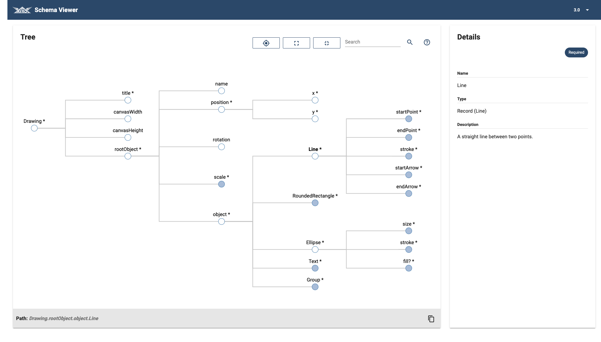

# Avro Schema Viewer

The Avro Schema Viewer is a visual way to represent an Avro schema. It is highly suitable for hierarchical schemas.



## Functionality

The Avro Schema Viewer offers the following:
 
- Pan and zoom functionality
- Search
- Expand / Collapse
- Schema entry details
- Deeplinks to elements in the schema

## Definitions

**Nullable**: a schema entry is a union, with one union schema entry that is _null_
**Required**: a schema entry does not have a default value (therefore it should be provided by the one that creates a record, hence, it's required)

## Viewing behavior
The schema viewer will traverse through the schema to display it. There are some caveats that are important when viewing the schema:

1. A `Union` / `ErrorUnion` / `Map` / `Array` with only one non-primitive element, will be displayed as a direct child
2. Elements that are childs of a `Record`, are displayed as `Field` objects
3. A unique name (called `fullpath`) is assigned to each element in the tree based on the name of the element and its parent(s). This is used for navigating to an element directly through the URL and for highlighting and selecting elements.

## Usage / Setup
You can set up the Avro Schema Viewer and use it as follows:

1. Clone this repository
2. Add `.avsc` files to `src/assets/avsc/<schema_version>/schema.avsc` (hence, a different _directory_ per schema, where the schema version is the name of that directory)
3. Ensure that the schema that needs to be shown in the viewer is named `schema.avsc`
4. Add a `versions.json` to the `avsc` directory and add the available version numbers in an array (e.g. `["0.1", "0.3", "0.6"]`)

An example directory tree of a correct setup:
```text
.
├── app
│   └── ...
├── assets
│   ├── ...
│   └── avsc
│       ├── versions.json
│       ├── 0.1
│       │   └── schema.avsc
│       ├── ...
│       └── 0.6
│           └── schema.avsc
└── ...
```

At bol.com, we have no schemas included in this repository itself, though we have a separate repository for our schema. Using Git tags, we generate all the `avsc` files for all versions of our schema and add it to this repository in the structure shown above in the build of the Avro Schema Viewer.

## Mockserver
A mockserver is included (`ng-apimock`) that ensures that there are some schemas are present when you start this project locally. Other schemas can be added easily, ensure that the path and the name of the mock are unique amongst each other.

## Build and contribute
We encourage contributors :) To build and work on this project, you need to have the following installed:
- Node >=8
- NPM + Yarn
- Angular CLI

Start the Avro Schema Viewer locally:
1. `yarn install`
2. `yarn start`

Feel free to file issues if you encounter bugs / have feature requests. Pull requests are much appreciated.

## Credits
TypeScript Avro implementation based on Python Avro implementation. Borrowed example `avsc` files from:
- [ept](https://github.com/ept/flow/blob/master/example.avsc)
- [apache/avro](https://github.com/apache/avro/blob/master/lang/java/avro/src/test/resources/SchemaBuilder.avsc)

## Disclaimer
Note that this is in development and bugs may be present, use at your own risk.

## Authors
This project is developed by [Mike Junger](https://github.com/MJunger) and [Robin Trietsch](https://github.com/trietsch).
